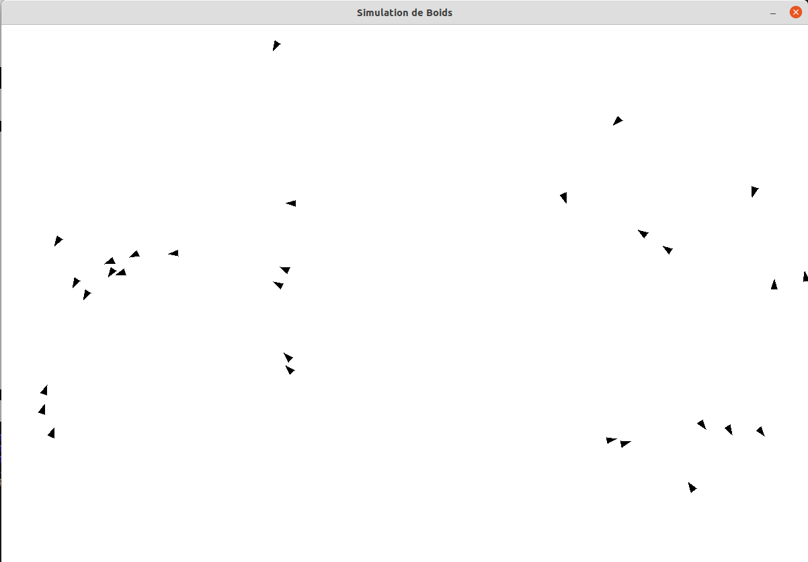

Simulation de Boids
===================

Origine du Projet
-----------------

La **simulation de Boids** est basée sur un modèle de comportement développé en 1986 par Craig Reynolds. Le but de ce modèle est de simuler le comportement de groupes d'oiseaux, de bancs de poissons ou d'autres animaux se déplaçant en cohésion. Ce modèle est devenu un standard pour la simulation de comportements collectifs en intelligence artificielle, en particulier dans le domaine de l'animation et des jeux vidéo.

Les **Boids** sont des entités simulées qui interagissent localement avec leurs voisins immédiats selon trois règles simples mais puissantes : cohésion, alignement et séparation. Ces règles, bien que simples, permettent de reproduire des mouvements de groupe complexes tels que les vols d'oiseaux ou les déplacements en banc de poissons.

Table des matières
------------------

-   [Origine du Projet](#origine-du-projet)
-   [Fonctionnalités](#fonctionnalit%C3%A9s)
-   [Prérequis](#pr%C3%A9requis)
-   [Installation](#installation)
-   [Exécution du projet](#ex%C3%A9cution-du-projet)
-   [Structure du projet](#structure-du-projet)
-   [Explication des Règles](#explication-des-r%C3%A8gles)
-   [Aperçu](#capture-d%C3%A9cran)
-   [Auteur](#auteur)

Fonctionnalités
---------------

-   **Cohésion** : Chaque boid se dirige vers le centre de masse de ses voisins pour maintenir la formation du groupe.
-   **Alignement** : Chaque boid ajuste sa direction pour s'aligner avec les boids à proximité.
-   **Séparation** : Chaque boid évite les collisions avec ses voisins les plus proches en maintenant une distance minimale.

Prérequis
---------

-   Python 3.x
-   Pygame (`pip install pygame`)

Installation
------------

1.  Clonez ce dépôt dans votre répertoire local :
```bash
    git clone https://github.com/josiashod/boids.git
    cd boids`
```

2. Créez un environnement virtuel avec venv :
```bash
    python3 -m venv env
```

3. Activez l'environnement virtuel :

   - Sur **Linux/Mac** :
     ```bash
     source env/bin/activate
     ```
   - Sur **Windows** :
     ```bash
     .\env\Scripts\activate
     ```

4. Installez les dépendances dans l'environnement virtuel :
   ```bash
   pip install pygame
   ```

## Exécution du projet

Pour lancer la simulation, assurez-vous que l'environnement virtuel est activé, puis exécutez le fichier `main.py` :
```bash
python main.py
```

## Structure du projet

- `main.py` : Ce fichier gère la fenêtre Pygame, initialise les boids, applique les règles et les affiche à l'écran.
- `boid.py` : Contient la classe `boid` qui implémente le comportement des boids (cohésion, alignement, séparation) ainsi que leur gestion des mouvements et interactions.

## Explication des Règles

1. **Cohésion** : Les boids se rapprochent du centre de masse de leurs voisins pour former un groupe cohérent.
2. **Alignement** : Les boids ajustent leur direction pour s'aligner avec la vélocité moyenne des boids voisins.
3. **Séparation** : Les boids évitent les collisions en maintenant une distance de sécurité avec leurs voisins immédiats.

Ces règles combinées permettent de reproduire des mouvements collectifs dynamiques et réalistes, tout en étant basées uniquement sur des interactions locales.

## Aperçu



## Auteur

Josias DJOSSOU-DAN - [djossoujosiashod@gmail.com](mailto:djossoujosiashod@gmail.com)
